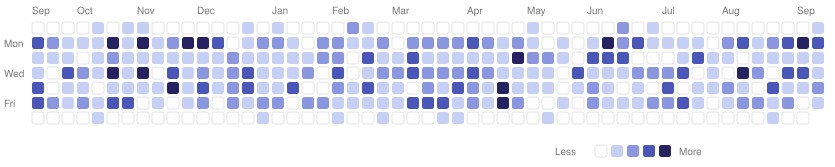

  <a href="README.md">🇬🇧 English</a> &nbsp;·&nbsp; <a href="README.ru.md">🇷🇺 Русский</a>

  

  

---

### 👨‍💻 Обо мне

- 🔭 Middle Frontend Developer — веду **3 продукта параллельно**
- 🧱 Отвечаю за качество кодовой базы и стандарты разработки в команде
- 🦊 Основная командная разработка ведётся в **GitLab** (приватные репозитории)
- ⚡ Люблю аккуратный, масштабируемый код, дизайн-системы и хороший UX

## 🛠️ Стек

Также: React Query, TanStack Table/Virtual, Recharts, uPlot, Service Worker + Background Fetch API, openapi-fetch / openapi-react-query

## 💼 Опыт

**БурСервис** · Россия · Нефть и газ &nbsp;|&nbsp; _Январь 2025 → Июнь 2026_

`Стажёр` → `Младший разработчик` → `Middle Frontend Developer`

> Веду 3 продукта параллельно, отвечаю за качество кодовой базы и стандарты разработки в команде.

## 🏆 Ключевые достижения

- 🎨 **UI/UX-библиотека компании на MUI** — спроектировал архитектуру и реализовал **85 переиспользуемых компонентов** с единой темой и дизайн-токенами. Принята как **стандарт для всех внутренних продуктов**; новые экраны собираются из готовых блоков вместо дублирования вёрстки.
- ⚡ **Фоновая загрузка Excel до 300 МБ** — реализовал через **Service Worker + Background Fetch API**: процесс не прерывается при закрытии вкладки или обновлении страницы. Статус импорта — в реальном времени по **WebSocket** вместо polling'а.
- 🤖 **Парсер документов с внутренней AI-моделью** — фронтенд сервиса, извлекающего данные из Excel и анализирующего их AI-моделью: загрузка, прогресс обработки, вывод и валидация распознанных полей.
- 📈 **Визуализация буровых данных** — плотные временные ряды на **Recharts / uPlot**, стриминг по **WebSocket/SignalR**, виртуализация таблиц через **TanStack Virtual**; интерфейс остаётся отзывчивым на больших выборках.
- 🔗 **Типобезопасная интеграция с бэкендом** — генерация типов из OpenAPI (`openapi-typescript` + `openapi-fetch` + `openapi-react-query`): контракты фронта и бэка синхронизируются автоматически.
- 🧱 **Рефакторинг legacy на слоистую архитектуру** — чёткие границы ответственности, переиспользуемые модули, рост масштабируемости и поддерживаемости.
- 📐 **Стандарты и процессы** — написал внутренний code style, провожу code review, веду техническую документацию; Docker для единого воспроизводимого окружения команды.

📜 Ранее в БурСервис

 

**Младший разработчик** · _Май 2025 → Август 2025_
- Перевёл крупный frontend-проект с **JavaScript на TypeScript** — типизировал компоненты и бизнес-сущности.
- Реализовал end-to-end функционал системы заявок: создание, обработка и проведение.
- Покрыл **~70% кодовой базы тестами** (Vitest, unit / integration) — меньше регрессий на релизах.
- Исправил **~4000 ESLint-ошибок**, повысив стабильность и поддерживаемость.
- Фильтрация таблиц с сохранением параметров в URL — пользователи делятся ссылками с текущими настройками.

**Стажёр** · _Январь 2025 → Апрель 2025_
- Устранил **6000+ ESLint-ошибок**, приведя кодовую базу к единому кодстайлу.
- Оптимизировал запросы и загрузку данных — страницы стали открываться **в 2–3 раза быстрее**.
- Перевёл работу с API с `fetch` на **React Query** (кеширование + автоматическая ревалидация).
- Закрыл **50+ задач** в корпоративном трекере (Redmine).

## 🦊 Активность в GitLab

Основная командная разработка ведётся в GitLab — приватные репозитории компании (код закрыт).
Ниже — снимок активности (issues, merge requests, pushes, comments):

  

## 📫 Контакты

